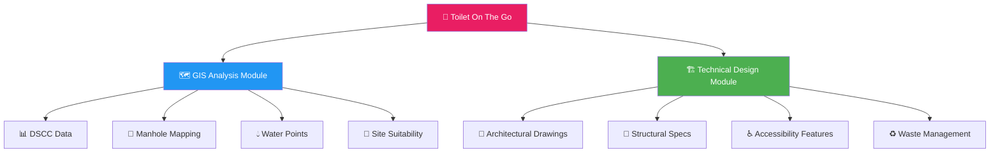

🚻 Toilet On The Go - WaterAid
"নির্ভর" - Dependable Sanitation for Everyone, Everywhere
Show Image
Show Image
Show Image
Show Image

A comprehensive mobile sanitation solution combining GIS-based site selection with innovative portable toilet facility design
📖 Documentation • 🚀 Getting Started • 👥 Contributors • 📞 Contact

📋 Table of Contents

Click to expand

🎯 About
🚨 Problem Statement
💡 Solution Overview
🏗️ Project Components
✨ Key Features
📐 Technical Specifications
🗺️ Methodology
📁 Project Structure
🚀 Getting Started
👥 Contributors
🙏 Acknowledgments
📄 License

🎯 About

🌍 Global Impact🏗️ Local Solution🤝 Community DrivenSupporting WaterAid's missionDesigned for BangladeshBuilt with local communities

Toilet On The Go is an integrated project by Team ProCritic that combines geographic information systems (GIS) analysis with sustainable sanitation infrastructure design. The project addresses the critical need for accessible, hygienic, and inclusive public toilet facilities in underserved areas, particularly in Bangladesh.
This initiative aligns with WaterAid's commitment to providing sustainable water, sanitation, and hygiene (WASH) solutions and contributes directly to UN Sustainable Development Goal 6: Clean Water and Sanitation.
🎯 Project Objectives
mermaidgraph LR
    A[🎯 Deploy Mobile Facilities] --> B[♿ Ensure Accessibility]
    B --> C[🌱 Self-Sustaining Infrastructure]
    C --> D[♻️ Environmental Sustainability]
    D --> E[👶 Inclusive Design]
    style A fill:#4CAF50
    style B fill:#2196F3
    style C fill:#FF9800
    style D fill:#9C27B0
    style E fill:#E91E63

🚨 Problem Statement
<table>
<tr>
<td width="50%">
📊 The Challenge
Bangladesh and many developing regions face severe sanitation challenges that impact millions of lives daily.
</td>
<td width="50%">
📈 By The Numbers
IssueImpact🚽 Limited Facilities2B+ people lack basic sanitation♿ Accessibility85% facilities non-accessible📍 Poor Placement60% underutilized🧼 Hygiene70% lack proper water supply
</td>
</tr>
</table>
🔴 Critical Issues:

Limited Public Facilities: Inadequate number of public toilets in urban and peri-urban areas
Accessibility Barriers: Lack of facilities for persons with disabilities, elderly, and parents with young children
Location Inefficiency: Poor placement of existing facilities leading to underutilization
Hygiene Concerns: Insufficient maintenance and water supply in public toilets
Emergency Preparedness: Absence of emergency sanitary supplies and first-aid provisions

💡 Solution Overview

🔄 Two-Pronged Approach

<table>
<tr>
<td width="50%" valign="top">
🗺️ 1. GIS-Based Site Selection
Using ArcGIS spatial analysis to identify optimal locations:

📊 Population density analysis
📍 Proximity to existing facilities
🛣️ Accessibility from major routes
💧 Water collection points
🤝 Community needs assessment

</td>
<td width="50%" valign="top">
🏗️ 2. Innovative Facility Design
A portable, self-contained toilet unit:

♿ Universal accessibility
🚺🚹 Gender-segregated facilities
👶 Baby diaper changing platform
🩹 Emergency sanitary supplies
📱 Mobile charging station
☀️ Solar power integration

</td>
</tr>
</table>

🏗️ Project Components

A. 🗺️ GIS Analysis Module
ComponentDescription🏛️ DSCC DataAdministrative boundary analysis🔧 Manhole DSCCExisting sewerage infrastructure mapping💧 Water Collection PointWater source proximity analysis🎯 Site SuitabilityMulti-criteria decision analysis for optimal placement
B. 🏗️ Technical Design Module
ComponentDescription📐 Architectural DrawingsComplete facility blueprints with dimensions🔨 Structural SpecificationsMaterials and construction guidelines♿ Accessibility FeaturesRamp design and wheelchair compatibility♻️ Waste Management SystemSeptic tank and desludging specifications

✨ Key Features

🌟 Feature Matrix

<table>
<tr>
<td width="50%" valign="top">
♿ Accessibility & Inclusivity
FeatureSpecification🦽 Wheelchair AccessRamp/staircase (60° angle)👶 Baby CareDedicated changing platform🚺🚹 Gender FacilitiesSeparate male/female📏 Interior Space4.5×4 feet per facility
</td>
<td width="50%" valign="top">
🔧 Infrastructure & Utilities
FeatureSpecification💧 Water Tank1000L capacity☀️ Solar PowerRenewable energy📱 Charging StationCommunity access💡 LED LightingEnergy-efficient
</td>
</tr>
<tr>
<td width="50%" valign="top">
🧼 Hygiene & Safety
FeatureSpecification🩹 Sanitary DispenserFree emergency supplies🚰 HandwashingMultiple water taps🗑️ Waste BinsDesignated disposal🧽 Easy CleaningSmooth surface materials
</td>
<td width="50%" valign="top">
♻️ Waste Management
FeatureSpecification🚰 Dual TanksEfficient collection🔧 Desludging AccessEasy maintenance🌱 Eco-FriendlyProper containment📊 MonitoringRegular inspection
</td>
</tr>
</table>

📐 Technical Specifications
📏 Overall Dimensions (Mobile/Portable Design)

DimensionMeasurementMetricPurpose📐 Total Length10 feet3.05 mStandard truck bed fit📐 Total Width8 feet2.44 mOptimal footprint📏 Height7.5 feet2.29 mAdequate headroom🚪 Individual Toilet4.5×4 feet1.37×1.22 mCompact + accessible

💡 Design Note: Dimensions optimized for standard 10-12 ft flatbed truck transportation while maintaining basic accessibility standards.

🚪 Door Schedule
<table>
<thead>
<tr>
<th>🆔 ID</th>
<th>📍 Location</th>
<th>🚪 Type</th>
<th>📏 Width × Height</th>
<th>🛠️ Material</th>
<th>🔧 Hardware</th>
<th>📝 Remarks</th>
</tr>
</thead>
<tbody>
<tr>
<td align="center"><b>D1</b></td>
<td>🚹 Male Toilet Entry</td>
<td>Single, Outward Swing</td>
<td>3'0" × 6'6" (914×1981 mm)</td>
<td>FRP/Aluminum</td>
<td>Lever handle Auto-close spring Indicator lock</td>
<td>Threshold-free 32" clear width min.</td>
</tr>
<tr>
<td align="center"><b>D2</b></td>
<td>🚺 Female Toilet Entry</td>
<td>Single, Outward Swing</td>
<td>3'0" × 6'6" (914×1981 mm)</td>
<td>FRP/Aluminum</td>
<td>Lever handle Auto-close spring Indicator lock</td>
<td>Threshold-free 32" clear width min.</td>
</tr>
<tr>
<td align="center"><b>D3</b></td>
<td>👶 Diaper Changing Area</td>
<td>Sliding/Folding</td>
<td>2'6" × 6'0" (762×1829 mm)</td>
<td>Lightweight FRP</td>
<td>Sliding latch Privacy screen</td>
<td>Space-saving design</td>
</tr>
<tr>
<td align="center"><b>D4</b></td>
<td>🔧 Septic Access Panel</td>
<td>Hinged Panel</td>
<td>2'0" × 2'0" (610×610 mm)</td>
<td>Steel/FRP</td>
<td>Lockable latch</td>
<td>Maintenance access only</td>
</tr>
</tbody>
</table>
🔑 Door Specifications
<table>
<tr>
<td width="33%">
🛠️ Material

Fiberglass Reinforced Plastic (FRP)
Powder-coated aluminum
Weather resistant
Anti-corrosion

</td>
<td width="33%">
🚪 Design

Outward swing for safety
Lever handles (ADA compliant)
32" minimum clear width
Louvered ventilation

</td>
<td width="33%">
🔒 Safety

Emergency release
Auto-close springs
Indicator locks
Stainless steel hardware

</td>
</tr>
</table>

🏗️ Facility Components

Per Side Configuration

<table>
<tr>
<td width="50%">
🚻 Sanitation

🚽 High commode (Western-style)
🚽 Low commode (Asian-style)
🚰 Water tap and basin
🧻 Tissue dispenser
🗑️ Waste bins

</td>
<td width="50%">
⚡ Utilities

🌀 Exhaust fan
💡 LED lighting
📱 Mobile charging point
🔌 Power outlets
🧼 Soap dispenser

</td>
</tr>
</table>

🔨 Structural Features
ComponentSpecificationDetails🛤️ Ramp-Staircase4 feet length, 60° angleInterchangeable for accessibility👶 Changing Platform3.5 feet heightFoldable, space-efficient📢 Advertisement PanelsExterior mountedRevenue generation☀️ Solar MountingRoof-top structure300W panel capacity🔧 Access PointsMultiple locationsEasy maintenance

📊 Capacity & Performance

MetricSpecificationPerformance💧 Water Storage1000 liters8-10 hours operation🚻 User Capacity50-75 users/dayHigh-traffic ready🔋 Solar Power300W system12-hour operation♻️ Waste StorageDual 500L tanks3-5 day capacity🧹 MaintenanceWeekly scheduleQuick desludging

🎨 Material Specifications
<table>
<thead>
<tr>
<th>Component</th>
<th>Primary Material</th>
<th>Secondary Options</th>
<th>Properties</th>
</tr>
</thead>
<tbody>
<tr>
<td>🏗️ <b>Structure Frame</b></td>
<td>Galvanized Steel</td>
<td>Aluminum Alloy</td>
<td>Corrosion-resistant, lightweight</td>
</tr>
<tr>
<td>🧱 <b>Wall Panels</b></td>
<td>FRP (Fiberglass)</td>
<td>Composite Sandwich</td>
<td>Weather-proof, easy to clean</td>
</tr>
<tr>
<td>🏠 <b>Roof</b></td>
<td>Insulated FRP</td>
<td>Metal Sheet + Insulation</td>
<td>UV resistant, heat insulation</td>
</tr>
<tr>
<td>🚪 <b>Doors</b></td>
<td>FRP/Aluminum</td>
<td>Composite</td>
<td>Durable, lightweight</td>
</tr>
<tr>
<td>🪟 <b>Flooring</b></td>
<td>Anti-slip FRP</td>
<td>Textured Composite</td>
<td>Water-resistant, easy cleaning</td>
</tr>
<tr>
<td>🚽 <b>Fixtures</b></td>
<td>Ceramic/Porcelain</td>
<td>Stainless Steel</td>
<td>Hygienic, durable</td>
</tr>
<tr>
<td>💧 <b>Water Tank</b></td>
<td>Food-grade Plastic</td>
<td>Stainless Steel</td>
<td>UV stabilized, safe</td>
</tr>
<tr>
<td>♻️ <b>Septic Tanks</b></td>
<td>HDPE Plastic</td>
<td>Fiberglass</td>
<td>Leak-proof, durable</td>
</tr>
</tbody>
</table>

🗺️ Methodology

🔄 Project Workflow
mermaidgraph TB
    A[🎯 Project Initiation] --> B[📊 Phase 1: GIS Analysis]
    B --> C[🏗️ Phase 2: Design Engineering]
    C --> D[📋 Phase 3: Implementation]
    
    B --> B1[📥 Data Collection]
    B --> B2[🗺️ Spatial Analysis]
    B --> B3[🎯 Site Selection]
    
    C --> C1[✏️ Conceptual Design]
    C --> C2[📐 Technical Design]
    C --> C3[🌱 Sustainability]
    
    D --> D1[📄 Documentation]
    D --> D2[💰 Cost Estimation]
    D --> D3[🚀 Deployment]
    
    style A fill:#E91E63,color:#fff
    style B fill:#2196F3,color:#fff
    style C fill:#4CAF50,color:#fff
    style D fill:#FF9800,color:#fff

📊 Phase 1: GIS-Based Site Selection
<table>
<tr>
<td width="33%" valign="top">
1️⃣ Data Collection

📊 Demographic data (DSCC)
🗺️ Existing facilities mapping
💧 Water source locations
🔧 Sewerage infrastructure
🚶 Pedestrian traffic data

</td>
<td width="33%" valign="top">
2️⃣ Spatial Analysis

👥 Population density mapping
📍 Proximity analysis
🛣️ Road accessibility
💧 Water proximity
🎯 Multi-criteria overlay

</td>
<td width="33%" valign="top">
3️⃣ Site Selection

🎯 Priority location ranking
🚶 Field validation surveys
🤝 Community consultation
✅ Final recommendations
📊 Impact assessment

</td>
</tr>
</table>

🏗️ Phase 2: Facility Design & Engineering
<table>
<tr>
<td width="33%" valign="top">
1️⃣ Conceptual Design

📋 User requirements
♿ Accessibility standards
📏 Space optimization
🎨 Aesthetic considerations
💡 Innovation integration

</td>
<td width="33%" valign="top">
2️⃣ Technical Design

📐 Architectural drawings
🔨 Structural calculations
🔌 Electrical layout
💧 Plumbing design
📝 Material specifications

</td>
<td width="33%" valign="top">
3️⃣ Sustainability

☀️ Solar system design
💧 Water conservation
♻️ Waste management
🔧 Maintenance protocols
🌱 Environmental impact

</td>
</tr>
</table>

📋 Phase 3: Implementation Planning
StepActivityDeliverableTimeline1️⃣Construction DocumentationComplete CAD drawingsWeek 1-22️⃣Cost EstimationBudget breakdownWeek 33️⃣Material ProcurementSupply chain planWeek 4-64️⃣Prototype ConstructionWorking modelWeek 7-105️⃣Testing & ValidationPerformance reportWeek 11-126️⃣Deployment StrategyRoll-out planWeek 13-147️⃣Maintenance SystemOperations manualWeek 15-16

📁 Project Structure
📦 Toilet-On-The-Go-WaterAid/
│
├── 🗺️ DSCC/                          # DSCC administrative data
│   ├── Administrative_Boundaries.shp
│   ├── Ward_Data.shp
│   └── Population_Stats.csv
│
├── 🔧 Manhole DSCC/                  # Sewerage infrastructure data
│   ├── Manhole_Locations.shp
│   ├── Sewer_Lines.shp
│   └── Infrastructure_Status.xlsx
│
├── 💧 Water Collection Point/        # Water source locations
│   ├── Water_Points.shp
│   ├── Supply_Network.shp
│   └── Quality_Reports.pdf
│
├── 📐 Technical Drawings/
│   ├── Technical_Drawing_4.pdf       # Complete facility blueprints
│   ├── Side_Views.dwg                # Left and right elevations
│   ├── Sections.dwg                  # Section A-A and B-B
│   ├── Floor_Plans.dwg               # Top view layouts
│   ├── Structural_Details.dwg        # Construction details
│   ├── Electrical_Layout.dwg         # Wiring and fixtures
│   ├── Plumbing_Layout.dwg           # Water and waste systems
│   └── Specifications.pdf            # Material and dimension specs
│
├── 🗺️ GIS Analysis/
│   ├── Site_Suitability.mxd          # ArcGIS project file
│   ├── Site_Suitability.aprx         # ArcGIS Pro project
│   ├── Population_Density.shp        # Demographic data
│   ├── Existing_Facilities.shp       # Current toilet locations
│   ├── Road_Network.shp              # Accessibility analysis
│   ├── Water_Proximity.shp           # Water source buffer
│   ├── Suitability_Raster.tif        # Suitability map output
│   └── Final_Sites.shp               # Recommended locations
│
├── 📄 Documentation/
│   ├── 📖 Methodology.pdf            # Detailed methodology
│   ├── 📱 User_Manual_Bengali.pdf    # Facility usage guide (Bengali)
│   ├── 📱 User_Manual_English.pdf    # Facility usage guide (English)
│   ├── 🔧 Maintenance_Guide.pdf      # Operations manual
│   ├── 💰 Cost_Estimation.xlsx       # Budget breakdown
│   ├── 📊 Impact_Assessment.pdf      # Social impact report
│   └── 🏗️ Construction_Manual.pdf    # Building guidelines
│
├── 🖼️ Images/
│   ├── Renders/                      # 3D visualizations
│   │   ├── Front_View.png
│   │   ├── Side_View.png
│   │   ├── Interior_Male.png
│   │   ├── Interior_Female.png
│   │   └── Isometric_View.png
│   ├── Field_Photos/                 # Site photographs
│   │   ├── Existing_Conditions/
│   │   ├── Survey_Photos/
│   │   └── Community_Meetings/
│   └── Diagrams/                     # Infographics and diagrams
│       ├── Feature_Diagram.png
│       ├── Accessibility_Guide.png
│       └── User_Instructions.png
│
├── 📊 Data/
│   ├── Survey_Results.xlsx           # Community survey data
│   ├── Traffic_Analysis.csv          # User flow data
│   ├── Cost_Analysis.xlsx            # Financial data
│   └── Performance_Metrics.xlsx      # KPI tracking
│
├── 📋 Templates/
│   ├── Maintenance_Log.xlsx          # Maintenance tracking
│   ├── Feedback_Form.pdf             # User feedback
│   ├── Inspection_Checklist.pdf     # Quality control
│   └── Incident_Report.docx          # Issue reporting
│
├── 📜 LICENSE                        # MIT License
├── 📖 README.md                      # This file
├── 🤝 CONTRIBUTING.md                # Contribution guidelines
└── 📝 CHANGELOG.md                   # Version history

🚀 Getting Started
📋 Prerequisites
<table>
<tr>
<td width="50%">
🗺️ For GIS Analysis
SoftwareVersionPurpose🗺️ ArcGIS Pro2.8+Primary GIS platform🔧 Spatial AnalystExtensionSite suitability analysis🛣️ Network AnalystExtension (Optional)Accessibility analysis📊 Microsoft Excel2016+Data processing
</td>
<td width="50%">
📐 For Technical Drawings
SoftwareVersionPurpose📐 AutoCAD2018+CAD drawings🎨 Adobe IllustratorCC 2020+Graphics & diagrams📄 Adobe AcrobatDCPDF documentation🖼️ SketchUp/RevitLatest3D visualization
</td>
</tr>
</table>

🗺️ Working with GIS Data

📂 Click to expand GIS workflow

Step 1: Open ArcGIS Project
🗺️ ArcGIS Pro:
1. Launch ArcGIS Pro
2. File → Open → Browse to project folder
3. Open: Site_Suitability.aprx
🗺️ ArcGIS Desktop:
1. Launch ArcMap
2. File → Open
3. Navigate to: GIS Analysis/Site_Suitability.mxd
Step 2: Review Data Layers
LayerDescriptionSource🏛️ DSCC BoundariesAdministrative limitsDSCC Open Data🔧 ManholesSewerage pointsDSCC Infrastructure💧 Water PointsWater collection locationsField Survey👥 Population DensityDemographic dataBBS Census🚻 Existing FacilitiesCurrent toiletsField Mapping
Step 3: Run Site Suitability Analysis
📊 Spatial Analyst Workflow:
1. Toolbox → Spatial Analyst Tools
2. Overlay → Weighted Overlay
3. Input rasters:
   - Population density (40% weight)
   - Distance to existing facilities (30% weight)
   - Road accessibility (20% weight)
   - Water proximity (10% weight)
4. Run analysis
5. Export results to Final_Sites.shp

📐 Viewing Technical Drawings

🏗️ Click to expand drawing guide

Viewing Order:

📄 Technical_Drawing_4.pdf

Overview of complete specifications
Side views (left and right)
Sections (A-A and B-B)
Dimension annotations

📐 AutoCAD Files (.dwg)

Open in AutoCAD 2018 or later
Layers organized by discipline:

🏗️ A-ARCH (Architecture)
🔨 S-STRU (Structural)
💧 P-PLUM (Plumbing)
⚡ E-ELEC (Electrical)

📝 Material Specifications

Review Specifications.pdf
Cross-reference with drawings
Note material codes and standards

🌐 Bengali Instructions

User guidelines in local language
Safety and maintenance instructions
Emergency procedures

👥 Contributors

🌟 Team ProCritic
Committed to improving sanitation access through innovative design and data-driven planning

<table>
<tr>
<td width="50%" align="center">

👨‍💼 Uday Karmoker
Jr. Design Engineer, CCECC
Show Image
Show Image
🎯 Responsibilities:

📐 Technical design & architectural drawings
🖥️ CAD modeling & specifications
♿ Accessibility feature design
📋 Construction documentation
🎨 3D visualization & rendering

</td>
<td width="50%" align="center">

👩‍💼 Umme Faria Rahim
M.Sc. in Construction Project Management
Show Image
🎯 Responsibilities:

📊 Project management
📊 Project management and coordination
📊 Budget Scheduling
📊 Operation and maintenance Ideation
📊 Requirements analysis and stakeholder engagement
📊 Implementation planning

---

### How to Contribute

We welcome contributions from:
- Urban planners and GIS specialists
- Civil engineers and architects
- WASH professionals
- Community organizers
- NGOs and development organizations

**To contribute:**
1. Fork the repository
2. Create a feature branch (`git checkout -b feature/GISAnalysis` or `feature/DesignImprovement`)
3. Commit your changes with clear messages
4. Push to the branch (`git push origin feature/YourFeature`)
5. Open a Pull Request with detailed description

## 🙏 Acknowledgments

- **WaterAid Bangladesh** - For their mission and guidance in addressing sanitation challenges
- **CCECC (China Civil Engineering Construction Corporation)** - For supporting sustainable infrastructure development
- **DSCC (Dhaka South City Corporation)** - For providing essential data and collaboration
- **Team ProCritic** - For dedicated effort in design and analysis
- Community members who participated in surveys and feedback sessions

## 📄 License

This project is licensed under the MIT License - see the [LICENSE](LICENSE) file for details.

---

## 📞 Contact & Support

**Repository**: [https://github.com/karmok3r/Toilet-On-The-Go-WaterAid](https://github.com/karmok3r/Toilet-On-The-Go-WaterAid)

**Issues & Suggestions**: [Report here](https://github.com/karmok3r/Toilet-On-The-Go-WaterAid/issues)

**For Implementation Inquiries**: Contact through GitHub or reach out to WaterAid Bangladesh

---

## 🌍 Project Impact

### Sustainable Development Goals
This project directly contributes to:
- **SDG 6**: Clean Water and Sanitation for all
- **SDG 11**: Sustainable cities and communities
- **SDG 3**: Good health and well-being

### Expected Outcomes
- ✅ Improved access to hygienic sanitation facilities
- ✅ Enhanced dignity and safety for vulnerable populations
- ✅ Reduced open defecation and waterborne diseases
- ✅ Better menstrual hygiene management
- ✅ Increased accessibility for persons with disabilities
- ✅ Data-driven infrastructure planning for cities
- ✅ Community empowerment through inclusive facilities

### Key Statistics
- **Target Users**: Thousands of daily users per facility in high-traffic areas
- **Accessibility**: 100% wheelchair accessible
- **Sustainability**: Solar-powered, reducing carbon footprint
- **Inclusivity**: Serves all genders, ages, and abilities

---

## 📊 Technical Highlights

### Innovation Points
1. **Integrated Approach**: Combines GIS analysis with engineering design
2. **Universal Design**: Accessibility for all users including PWDs
3. **Self-Sustaining**: Solar power and water storage
4. **Modular Design**: Easy transportation and installation
5. **Community Features**: Charging station and advertisement space for sustainability
6. **Bilingual Instructions**: Bengali user guidelines for local communities

### Design Excellence
- Compact yet spacious 8×10 feet footprint
- Dual toilet options (high and low commode)
- Emergency sanitary supplies
- Proper ventilation and natural light integration
- Easy maintenance with accessible desludging system

---

## 📚 Additional Resources

### Related Documents
- User Manual (Bengali/English)
- Maintenance and Cleaning Guidelines
- Desludging Schedule and Procedures
- Solar Panel Maintenance Guide
- Community Feedback Forms

### Reference Standards
- Bangladesh National Building Code (BNBC)
- WHO Guidelines for Sanitation and Health
- Universal Design Principles
- WASH Sector Standards

---

**Made with ❤️ by Team ProCritic for universal sanitation access**

**"নির্ভার" - Dependable Sanitation for Everyone, Everywhere**
